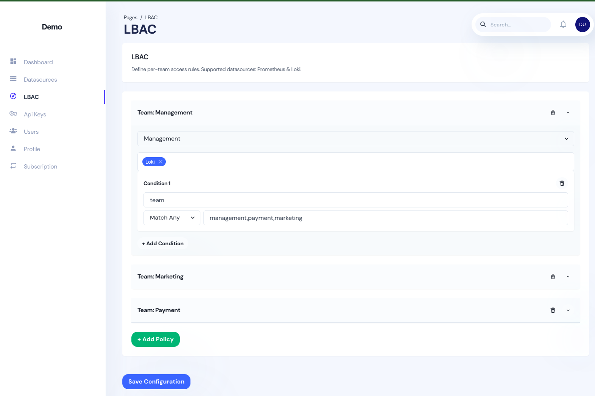

# Giam: LBAC Proxy for Prometheus, Thanos & Loki

Giam is a lightweight **Label-Based Access Control** (LBAC) proxy that sits in front of your Prometheus/Thanos and Loki instances. Without changing your dashboards or instrumentation, Giam automatically rewrites every PromQL (metrics) and LogQL (logs) query to enforce per-team, per-environment, or per-cluster authorization rules.

## Key Features

- **Cost-Saving**  
  Eliminate heavy licensing fees; pay only for what you need.

- **Effortless Integration**  
  Deploy as a proxy in front of your existing observability stack—no code changes, no maintenance headaches.

- **Identity Provider Integration**  
  Sync users, teams, and groups from any OAuth2/OIDC provider (e.g. Okta, Auth0) or use Grafana Teams. Giam will automatically apply the right LBAC policy for each authenticated user.

- **Granular Control**  
  Define per-team, per-data-source, or per-query rules via an intuitive configuration interface.

- **Peace of Mind**  
  Prevent data leaks and standardize security without big-enterprise overhead.

## LBAC Configuration UI

Below is an example of Giam’s web UI where you can define per-team access policies for Prometheus and Loki:

1. **Select Team** – Choose or import a team from your identity provider.
2. **Select Datasource** – Apply rules to Prometheus/Thanos (metrics) or Loki (logs).
3. **Add Conditions** – Build Match Any / Match All / Exclude rules on labels like `cluster`, `environment`, or custom tags.

## Quick Start

1. **Register**  
   Quick signup to access through [Portal](https://portal.usegiam.com). Get started in minutes.

2**Configure**  
   Set up access controls, policies, and roles to fit your organization’s needs.

4. **Secure**  
   Activate enterprise-grade security features and enjoy real-time data protection.

## Documentation & Support

- [Getting Started Guide](https://www.usegiam.com#getting-started)  
- [Full Documentation](https://www.usegiam.com/documentation)  
- [FAQs](https://www.usegiam.com#faqs)  

## Get In Touch

- **Contact Us:** [Contact](https://www.usegiam.com/contact)  
- **Careers:** [Join the Team](https://www.usegiam.com/careers)  
- **Sign In:** [Portal](https://portal.usegiam.com)  

---
